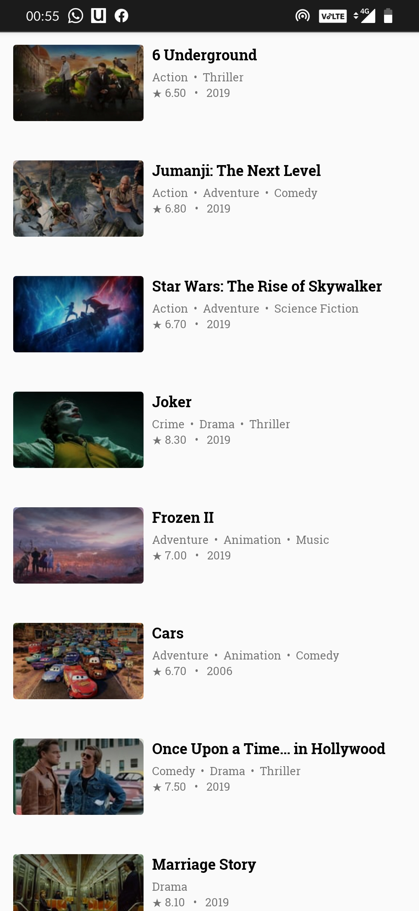
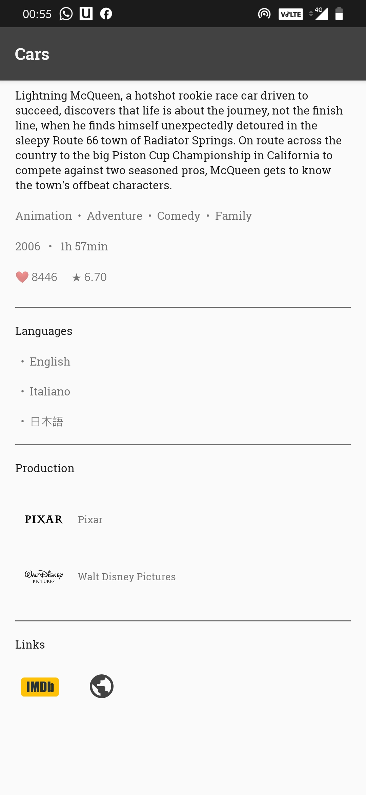

# MovieApp

#### Libraries
- [Android X](https://developer.android.com/jetpack/androidx)
- [Retrofit](http://square.github.io/retrofit/)
- [Glide](https://github.com/bumptech/glide)
- [LiveData and ViewModel](https://developer.android.com/topic/libraries/architecture/)
- [Databinding](https://developer.android.com/topic/libraries/data-binding/)
- [Paging](https://developer.android.com/topic/libraries/architecture/paging)

